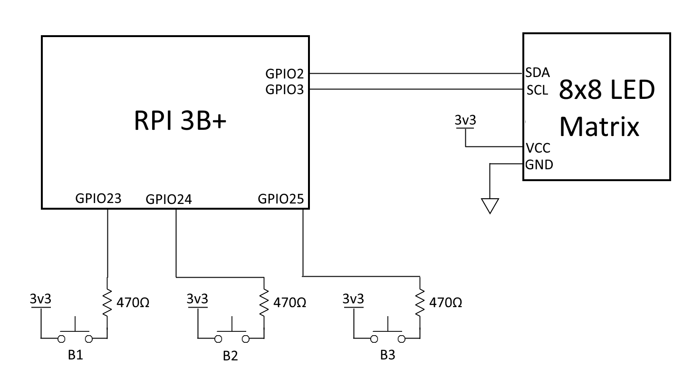

# LifeDisplay
This project implements Conway's Game of Life in C and displays it using an 8x8 LED matrix and the Raspberry Pi.  

## Hardware
The required materials are:  

 - One HT16K33 8x8 LED Backpack, with a matching 8x8 bi-color LED matrix square
 - One Raspberry Pi (RPI). This project was designed and tested on the Raspberry Pi 3B+
 - Three push buttons and three 470 ohm resistors
 - A breadboard and some wires / jumper cables

To attach and use the listed components, follow these steps:  
1. Connect an RPI 3.3V pin to the 'VCC' pin of the LED matrix
2. Connect an RPI GND pin to the 'GND' pin of the LED matrix
3. Connect the RPI SCL pin to the 'SCL' pin of the LED matrix
4. Connect the RPI SDA pin to the 'SDA' pin of the LED matrix
5. Connect a button through a 470 ohm resistor to GPIO 24 on the RPI
6. Connect a button through a 470 ohm resistor to GPIO 25 on the RPI
7. Connect a button through a 470 ohm resistor to GPIO 26 on the RPI



## Building  
To compile the program, run ```make``` in the project directory. You can then test the various components with ```test_display``` and ```test_buttons```

## Usage  
Once everything has been wired correctly, run ```./game``` in a terminal. The game will then start.
To edit the game grid, press button one to toggle between play and edit mode. When in edit mode, press button three to move the cursor and button two to toggle the selected cell on and off.
Enjoy!


